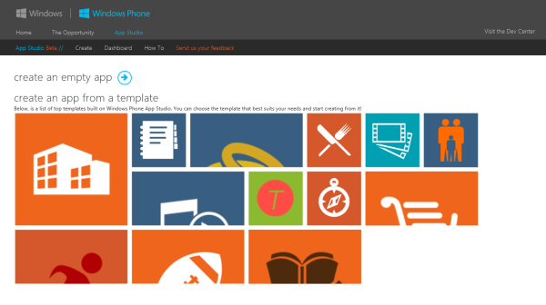
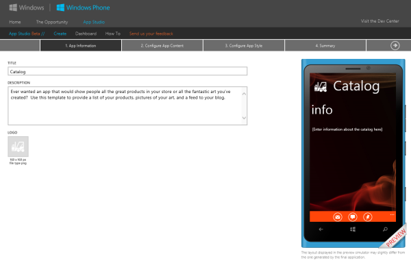
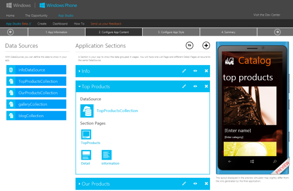
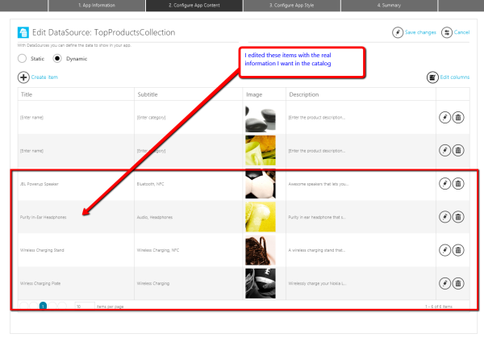
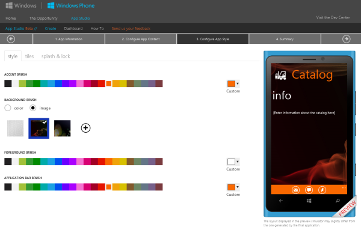
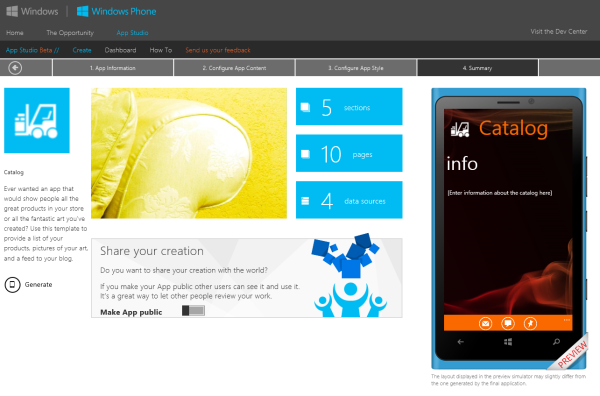

Microsoft has just launched a new Windows Phone app builder website, [Windows Phone App Studio](http://apps.windowsstore.com/default.htm). You can now build a great looking app in no time and earn a free phone from me in the process. You don't need to be a great programmer, but if you are... you get the source code for the app when you're done with the template! No other app builder does that for you.

Just a few easy steps to make your first Windows Phone app AND you get to unlock your phone in the process.

Pick one of 12 templates that best fit your idea. From fitness and sports to inventory and business store fronts.

[

Add some title and description info

[

Now add the content. Get it from a rss stream or add it directly with an easy to use interface.

[

I am adding some of the items I regularly give away to the developer in my region...

[

Style the UI with easy to use color selectors

[

Final summary and app generation and you're almost done..

[

Now just generate the app files, you'll get a XAP file that you can now side load on your phone or you can download the source code and compile it yourself (recommended).

Now that you have an easy way to get your first app done, there's no excuse I shouldn't be putting your mailing address on a new phone :)
