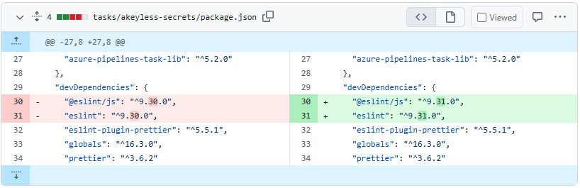

Most of us are familiar with Dependabot and how it can open an Issue in your GitHub repo when there's a pending dependency update or a security issue. However, did you know that you can also have it automatically open a Pull Request, do all the builds, make sure checks pass, and **merge** it, too?

I find this capability very helpful and time saving when the dependencies are not core SDK components. Particualrly with node.js projects, there are can be a lot of updates that are not related directly to the code, but instead of part of the toolchain or IDE. These updates take time to manually do and can be annoying to maintain.

So today I will share a quick example of automating Dependabot PRs to complete the entire lifecycle and automatically merge updates. First take a look at [Bump the dependencies group in /tasks/akeyless-secrets with 2 updates](https://github.com/LanceMcCarthy/akeyless-extension-azdo/pull/59).

The PR is only for eslint updates:



this would normally take me time to complete the PR, but I have a secret up my sleeve... see [workflows/dependabot-auto-merge.yml](https://github.com/LanceMcCarthy/akeyless-extension-azdo/blob/main/.github/workflows/dependabot-auto-merge.yml). That is a GitHub Action that will keep an eye on any Dependabot submitted PRs and merge the changes!

Let's go through it using comments:

```yaml
name: 'Dependabot Auto-merge'

on:
# This workflow is triggered when a Pull Request is opened for the main branch.
  pull_request_target:
    branches: [main]

# We need certain permissions to make changes to the repo's contents
permissions:
  contents: write
  pull-requests: write

# these are the steps that will occur when the workflow runs
jobs:
# The name of the job
  dependabot:
# We will run the job on Ubuntu
    runs-on: ubuntu-latest
# but only if Dependabot opened the PR
    if: ${{ github.actor == 'dependabot[bot]' }}
    steps:
# Step 1 - We get all the Dependabot's metadata
      - name: Dependabot metadata
        id: metadata
        uses: dependabot/fetch-metadata@v1
        with:
          github-token: "${{ secrets.GITHUB_TOKEN }}"

# Step 2 - Wait to confirm all the checks complete successfully
      - name: Wait for status checks
        id: wait-for-status
        uses: lewagon/wait-on-check-action@v1.3.1
        with:
          ref: ${{ github.event.pull_request.head.sha }}
          repo-token: ${{ secrets.GITHUB_TOKEN }}
          wait-interval: 20
          running-workflow-name: dependabot
          allowed-conclusions: success
# Step 3 - Merge the PR, but with the following conditions:
# Do not auto-merge major version changes (they might contain breaking changes)
# Do not merge if there's a package's name contains 'akeyless'  I always want to verify compatibility for these updates
      - name: Auto-merge non-major updates
        if: ${{ steps.metadata.outputs.update-type != 'version-update:semver-major' && !contains(steps.metadata.outputs.dependency-names, 'akeyless') }}
        run: |
          gh pr review --approve "$PR_URL"
          gh pr merge --auto --squash "$PR_URL"
        env:
          PR_URL: ${{github.event.pull_request.html_url}}
          GITHUB_TOKEN: ${{ secrets.GITHUB_TOKEN }}
```

You can use that same YAML for your repo, just make some customizations in that last step. for example, you dont need to check for 'akeyless' etc. For more information and examples, visit [](https://docs.github.com/en/code-security/dependabot/working-with-dependabot/automating-dependabot-with-github-actions).

If you have any questions or need help, don't hesitate to reach out to me [dvlup.com/about/](https://dvlup.com/page/about/) (or [bsky - @lance.boston](https://bsky.app/profile/lance.boston) | [x - @l_anceM](https://x.com/l_anceM) )
